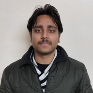

<!-- (comment) the image below can be found in img folder of this very project-->
<!--{: style="float: right; margin: 0px 20px; width: 180px;" name="fox"}-->
<!--{: style="float: right; margin: 0px 20px; width: 180px;" name="fox"}-->
{: style="float: right; margin: 0px 20px; width: 250px; border-radius: 50%" name="fox"}

<!--  -->

I am Harsh Raj, an __Applied Scientist__ at [__VijilAI__](https://www.vijil.ai/) working on red-teaming and evaluating Langauge Models. 

<!-- Also, [__NLP Course__ __For You__](https://lena-voita.github.io/nlp_course.html) creator and current [SIGREP](https://www.sigrep.org) president. -->
<!--* a __Research Scientist__ at [__FAIR__](https://ai.facebook.com) working on NLP,* current [SIGREP](https://www.sigrep.org) president,* NLP Course For You creator - look [here](https://lena-voita.github.io/nlp_course.html).-->

Broadly, I am interested in making language models safe, useful, and controllable. Over the past few years, I have taken my first baby steps as a researcher, owing to some wonderful people and collaborations. 

Most recently, I am working with some folks from [CSAI](https://www.safe.ai/) (particularly [Dom](https://scholar.google.com/citations?user=80aJAKYAAAAJ&hl=en)) on mitigating finetuning attacks on LLMs and reward hacking as a consequence of it. Being an Applied Scientist at [VijilAI](https://www.vijil.ai/), I am working on building the largest database of red teaming prompts with [Leif](https://boltzmann-brain.github.io/).

Before that, I worked with [Subho](https://www.subhomajumdar.com/), Dom, and [Vipul](https://vipulgupta1011.github.io/) on [evaluating](https://arxiv.org/abs/2211.05853) and [improving](https://arxiv.org/abs/2308.09138) the consistency of language models.  

I was fortunate to collaborate via the [MLC community](https://mlcollective.org/community/) with [Yash](https://www.yash-sharma.com/) and [Laura](https://www.linkedin.com/in/lfee-schneider/?locale=en_US) on quantifying the robustness transfer from pretraining to downstream tasks from the lens of computer vision.

I did my bachelor thesis with [Anil S. Parihar](https://scholar.google.com/citations?user=JRr4wjoAAAAJ&hl=en) on Vision and Language Navigation (VLN) and fortunately, we secured a top-3 position in the most popular VLN challenge [R2R](https://scholar.google.com/citations?user=JRr4wjoAAAAJ&hl=en). 

I also spent my summer internship during my undergrad at [Thoucentric](https://thoucentric.com/) as a researcher with [Manu](https://deep-and-shallow.com/about-me/) where I studied tabular data and built a [novel](https://arxiv.org/abs/2207.08548) deep learning framework.

I am actively looking for PhD in Ai Safety starting Fall 2025.

## News and Timeline

### 2024
- **August**: Contributed `deception_adherence` attack to [ps-fuzz](https://github.com/prompt-security/ps-fuzz).
- **June**: Released preprint on our work on consistency control in LLMs, mentored by Subho.
- **January**: Joined VijilAI as an Applied Scientist.
- **January**: Our work on Vision and Language Navigation ranked 3rd on the [R2R leaderboard](https://eval.ai/web/challenges/challenge-page/97/leaderboard/270). Team Name: `MLR_Lab_DTU`.

### 2023
- **December**: Presented our work on robustness transfer at NeurIPS 2023 in New Orleans.
- **May**: Our work on robustness transfer accepted to NeurIPS 2023. Led by [Laura](https://www.linkedin.com/in/lfee-schneider/?locale=en_US) and mentored by [Yash](https://www.yash-sharma.com/).

### 2022
- **November**: Our work on consistency evaluation won the [Best Paper Award](https://www.mlsafety.org/events/neurips/2022) with a cash prize of $5000.
- **April**: Two papers accepted to NeurIPS Workshop 2023: one on consistency evaluation and another on evaluating the robustness of biomedical concept normalization.

<!--__Blog-course:__    NLP Course For You - look [here](https://lena-voita.github.io/nlp_course.html).-->

<!-- ## News and Timeline 

__2023__

* Senior Area Chair:  [EACL 2024](https://2024.eacl.org).
* Area Chair: [ACL 2023](https://2023.aclweb.org), [EMNLP 2023](https://2023.emnlp.org), [IJCNLP-AACL 2023](http://www.ijcnlp-aacl2023.org).
* Teaching: [Oxford-LLMs summer school](https://www.llmsforsocialsciene.dev/about/).
* Invited talks: [TTI Chicago](https://www.ttic.edu/young-researcher/), [RISE Learning Machines seminar](https://www.ri.se/en/learningmachinesseminars), [University of Melbourne](https://cis.unimelb.edu.au/research/artificial-intelligence/research/Natural-Language-Processing),
[Instituto Superior Técnico](https://sardine-lab.github.io), [UKP-CIS Joint Invited Talk Series]().

__2022__

* Senior Area Chair:  [AACL-IJCNLP 2022](https://www.aacl2022.org/).
* Area Chair: [EMNLP 2022](https://2022.emnlp.org/), [EACL 2023](https://2023.eacl.org).
* Keynote: [BlackBoxNLP workshop at EMNLP 2022](https://blackboxnlp.github.io).
* Teaching: [SICSS-Oxford](https://sicss.io/2022/oxford/), invited lecture at EPFL.
* Job started: Research Scientist at [FAIR](https://ai.facebook.com) (November).
* Visiting [SARDINE Lab](https://sardine-lab.github.io): [André Martins](https://andre-martins.github.io)'s group at [Instituto Superior Técnico](https://tecnico.ulisboa.pt/pt/) (February-July). 

__2021__

* Keynotes: [DeeLIO workshop at NAACL 2021](https://sites.google.com/view/deelio-ws/), [RepL4NLP workshop at ACL 2021](https://sites.google.com/view/repl4nlp-2021/home).
* Invited talks: [Stanford NLP Seminar](https://nlp.stanford.edu/seminar/), CornellNLP, [MT@UPC](https://mt.cs.upc.edu/seminars/), CambridgeNLP, [Helsinki LT Seminar](https://blogs.helsinki.fi/language-technology/research-seminar/), ["Shannon meets Turing" Colloquium](https://www.youtube.com/channel/UCjltmKOomhdXQELWi6asoBg), "Young Innovators" talks (Austria), [Glasgow IR seminar](https://samoa.dcs.gla.ac.uk/events/viewtalk.jsp?id=18008).
* Papers: [Source and Target Contributions](https://arxiv.org/pdf/2010.10907.pdf) at ACL, [NMT Training through the Lens of SMT](https://arxiv.org/abs/2109.01396) at EMNLP.

__2020__
 
* Award: I'm [awarded Facebook PhD Fellowship](https://research.fb.com/blog/2020/01/announcing-the-recipients-of-the-2020-facebook-fellowship-awards/).
* Keynote: NLP track at [Applied Machine Learning Days at EPFL](https://appliedmldays.org/tracks/ai-nlp).
* Invited talks: [NLP Highlights podcast](https://soundcloud.com/nlp-highlights/98-analyzing-information-flow-in-transformers-with-elena-voita), [Rasa](https://www.meetup.com/ru-RU/Bots-Berlin-Build-better-conversational-interfaces-with-AI/events/267058207/), Google Research Berlin, [Naver Labs Europe](https://europe.naverlabs.com/research/seminars/analyzing-information-flow-in-transformers/), MIT, DeepMind, [Grammarly AI](https://grammarly.ai/information-theoretic-probing-with-minimum-description-length/), Unbabel, [NLP with Friends](https://nlpwithfriends.com), CMU, [USC ISI](https://nlg.isi.edu/nl-seminar/), ENS Paris, [ML Street Talk](https://www.youtube.com/watch?v=Q0kN_ZHHDQY).
* Papers: 2 papers at EMNLP, [BPE-dropout](https://arxiv.org/pdf/1910.13267.pdf) at ACL.

__2019__
* Papers: 2 papers at ACL (one is oral), 2 papers at EMNLP, 1 at NeurIPS. -->
